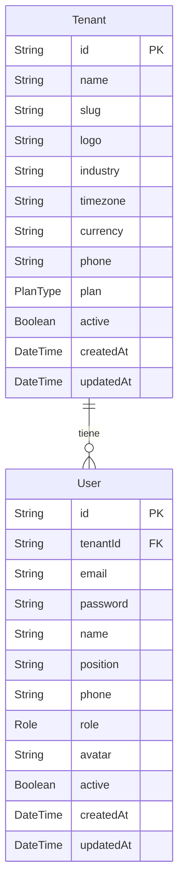
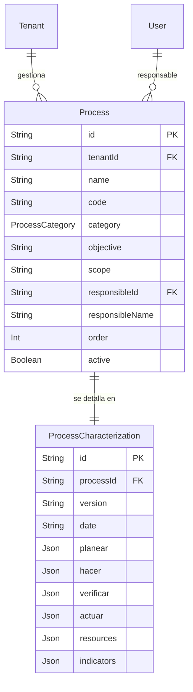
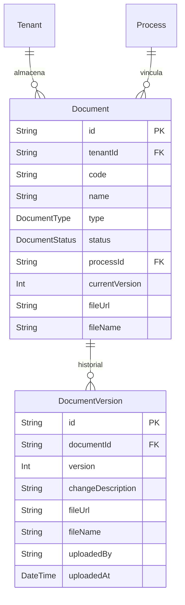
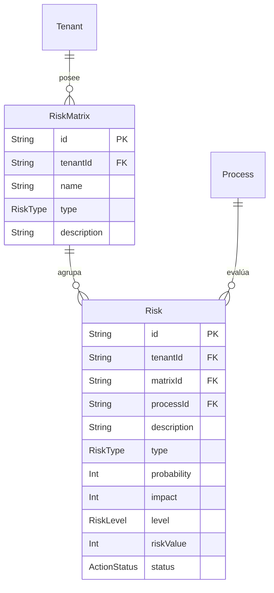
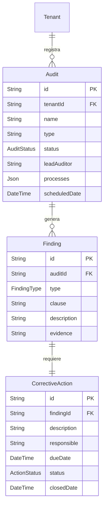
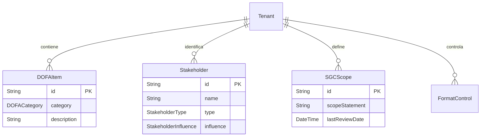

# 📊 Diagrama Técnico de Base de Datos (SGC SaaS)

Este diagrama representa la estructura completa de tu base de datos PostgreSQL basada en el archivo `schema.prisma`. 

## 1. Módulo Core y Usuarios

## 2. Gestión de Procesos (ISO 9001)

## 3. Gestión Documental y Versiones

## 4. Gestión de Riesgos y Matrices

## 5. Auditoría y Mejora Continua

## 6. Contexto y Otros

